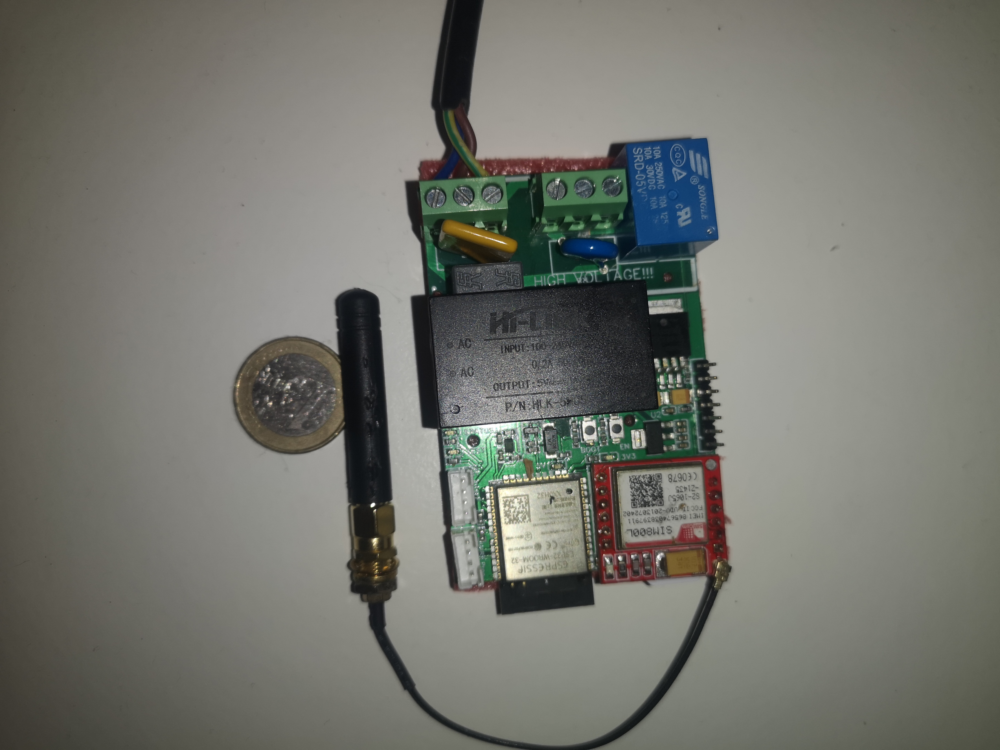

# IoT Emergency Light Health Monitoring System

I developed this project as a retrofit **emergency-light health checker** that could automate discharge testing, measure light output and report test data remotely over a cellular connection.

The prototype combines an **ESP32**, **SIM800L GPRS modem**, **BH1750 lux sensor**, relay-controlled test switching and an **AWS IoT / MQTT** reporting path. I designed the hardware, PCB and firmware, assembled the prototype and tested the retrofit concept in an emergency-light fitting.

> **Status:** completed prototype / portfolio project. This repository documents the engineering work; it is not a certified product design, installation guide or safety-approved release package.



## What the system does

Emergency lights require periodic testing to confirm that the battery can keep the fitting illuminated during a simulated loss-of-mains condition.

I designed the prototype to:

- place the emergency-light fitting into a controlled test state using a relay;
- measure light output with a BH1750 digital lux sensor;
- use an ESP32 as the main controller;
- communicate through a SIM800L cellular modem;
- publish lux level, mobile signal strength, timestamp, test type and installation metadata over MQTT;
- support cloud-side scheduling and processing using AWS IoT services; and
- provide the measurement data needed by the backend to derive maintenance / pass-fail results.

The public firmware and example payloads show the measured test data sent by the device. Pass/fail evaluation is treated as a **cloud/reporting function**, rather than a field generated directly by the ESP32 firmware.

## System architecture

```text
Emergency-light fitting
        |
        v
 Relay-controlled test switching
        |
        +----------------------+
        |                      |
        v                      v
      ESP32                 BH1750
        |                 lux measurement
        |
        v
     SIM800L
   GPRS / cellular
        |
        v
   MQTT / AWS IoT
        |
        v
 Test-data storage / processing / reporting
```

## Hardware

The prototype hardware includes:

| Block | Implementation |
|---|---|
| Controller | ESP32 WROOM module |
| Cellular modem | SIM800L GPRS module |
| Light sensor | BH1750 digital lux sensor |
| Test switching | Relay-controlled emergency-light test circuit |
| Power | AC/DC conversion with 5 V, 3.3 V and 4.1 V rails |
| Interfaces | UART, I²C and external expansion/debug connections |

I separated the mains/relay area from the low-voltage controller, sensor and modem circuitry in the PCB layout and carried the design through to a manufactured and assembled prototype.

- **[As-built prototype schematic](Hardware/Schematic/Schematic_ESP32_AC_SIM800L_AsBuilt_Prototype.pdf)**
- **[Hardware / PCB evidence](Hardware/PCB/)**
- **[Prototype and installation images](Hardware/Images/)**

I also explored a later design variant with the cellular modem integrated directly onto the PCB. I keep that clearly separated from the as-built prototype evidence:

- **[Integrated SIM800C design variant](Hardware/Schematic/Design_Variants/Schematic_ESP32_SIM800C_OnPCB_Concept.pdf)**

## Firmware

I developed the public portfolio firmware using **ESP32 + Arduino framework + PlatformIO**. It demonstrates the main prototype behaviour:

- SIM800 cellular connection;
- secure MQTT connection to AWS IoT;
- BH1750 light measurement;
- relay test control;
- storage of installation details in ESP32 NVS;
- remote configuration commands; and
- JSON-style test-result publishing.

Private AWS credentials, device certificates, private keys and production APN details are not included.

- **[Firmware source](Firmware/src/main.cpp)**
- **[Firmware notes and build instructions](Firmware/README.md)**
- **[MQTT topic structure](Firmware/mqtt_topic_structure.md)**

## Cloud / data flow

The prototype used a cloud-reporting flow based around cellular MQTT messaging and AWS IoT services. The device publishes test measurements and installation metadata; the cloud side can then store, process and report the results.

A representative device payload contains fields such as:

```json
{
  "ID": "REDACTED_DEVICE_ID",
  "Cus": "REDACTED_CUSTOMER",
  "Loc": "REDACTED_LOCATION",
  "Test": "30m",
  "Lux": 154.2,
  "SigS": 15
}
```

- **[Cloud / MQTT reporting flow](Cloud/)**
- **[Redacted example payload](Cloud/Example_JSON_Payload_Redacted.md)**
- **[Redacted example test data](Data/)**

## Bring-up and test approach

I treated the project as a complete embedded system rather than only a PCB exercise. My work covered:

- system concept and architecture;
- schematic design and PCB layout;
- mains/low-voltage partitioning;
- ESP32, SIM800L and BH1750 integration;
- relay-controlled emergency-light testing;
- prototype assembly and installation;
- firmware development;
- MQTT / AWS IoT integration; and
- collection of representative test data.

The repository includes PCB-layer views, Gerber/manufacturing evidence, the assembled board, an installed prototype, firmware and cloud/data documentation.

## Prototype limitations and future improvements

The design reflects the technology and goals of the original prototype. If I were developing a current production version, I would revisit several areas:

- replace the legacy **2G/GPRS SIM800L** with a current cellular technology such as LTE-M / NB-IoT where appropriate;
- add a **local maximum test-duration fail-safe** so loss of a cloud-side end command cannot leave the relay in test mode indefinitely;
- replace simple numeric MQTT commands with structured command messages and acknowledgements;
- use controlled manufacturing provisioning for device identity and credentials;
- complete formal safety, EMC, reliability and regulatory work before any product release; and
- define production test, installation and service procedures.

These are deliberately presented as future engineering steps rather than claims about the prototype.

## Repository structure

```text
IoT-Emergency-Light-Health-Monitoring-System/
├── Cloud/          # AWS IoT / MQTT reporting evidence
├── Data/           # redacted example test data
├── Documentation/  # project overview material
├── Firmware/       # public ESP32 / PlatformIO portfolio firmware
├── Hardware/       # schematic, PCB and prototype evidence
└── README.md
```

## Safety and portfolio note

This prototype involved **mains-voltage switching**. I include the repository as evidence of my electronic design, embedded firmware, PCB, IoT and system-integration work. It should not be treated as an installation guide, certified emergency-light controller or safety-approved production design.
